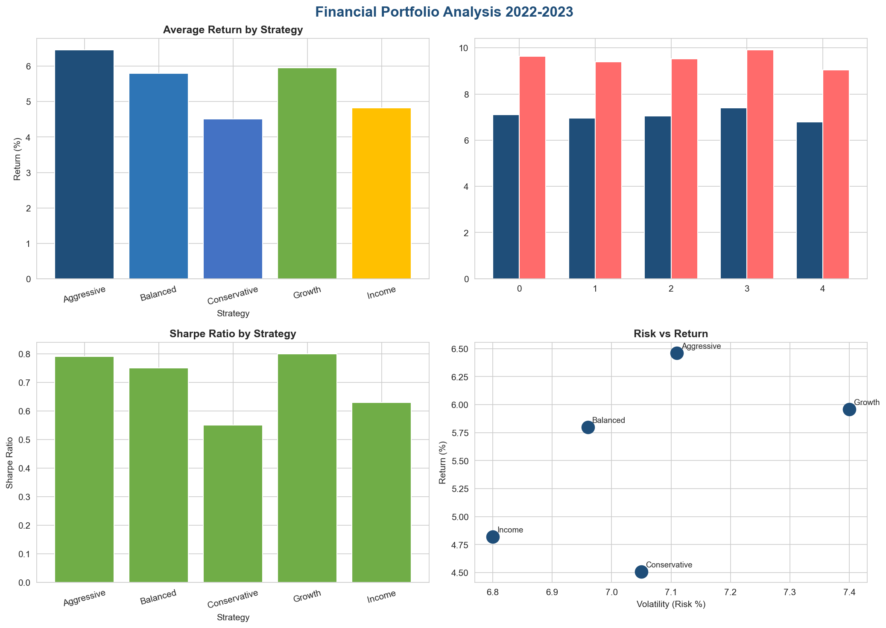
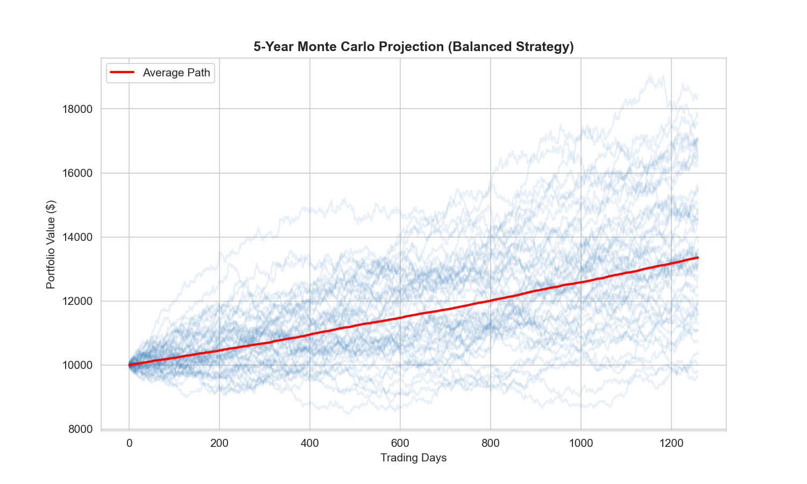
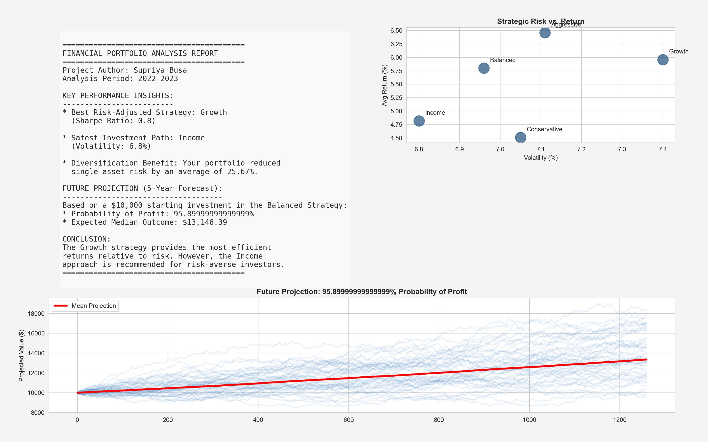

# 📈 Financial Portfolio Analysis Engine

A professional Python-based tool for analyzing investment portfolios, calculating risk/return metrics, and performing **Monte Carlo Simulations** for future wealth projections.

## 🚀 Key Features
* **Performance Metrics:** Calculates Sharpe Ratio, Volatility, and Cumulative Returns.
* **Monte Carlo Simulation:** 1,000+ iterations to forecast 10-year portfolio growth.
* **Automated Reporting:** Generates investor-ready charts and CSV summaries.

## 📊 Visual Analysis
### Portfolio Growth & Risk


### 10-Year Monte Carlo Projection


### Final Investor Report


## 🛠️ Tech Stack
* **Python 3.x**
* **Pandas** (Data Manipulation)
* **Matplotlib/Seaborn** (Data Visualization)
* **NumPy** (Financial Calculations)

## 🔍 What is a Monte Carlo Simulation?

In this project, I used a **Monte Carlo Simulation** to forecast the potential future value of a portfolio. 

### How it works:
* **The Problem:** Traditional financial models often assume a constant "average" return (e.g., 7% every year), which is unrealistic because markets are volatile.
* **The Solution:** Instead of one fixed path, the simulation runs **1,000+ different "what-if" scenarios** based on historical mean returns and standard deviation (risk).
* **The Result:** By simulating thousands of possible market paths, we can calculate the **probability** of reaching a specific financial goal. 

> **Key Insight:** This allows investors to see not just the "best case," but also the "worst case" and "most likely" outcomes for their wealth over the next 10 years.

## ⚙️ How to Run this Project

1. **Clone the repository:**
   ```bash
   git clone [https://github.com/ravithasupriya24-crypto/financial-portfolio-analysis-project-engine.git](https://github.com/ravithasupriya24-crypto/financial-portfolio-analysis-project-engine.git)

  ```bash
pip install -r requirements.txt
  ```bash
python portfolio_analysis.py
